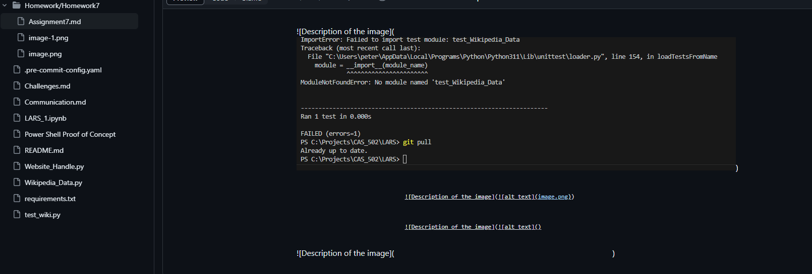
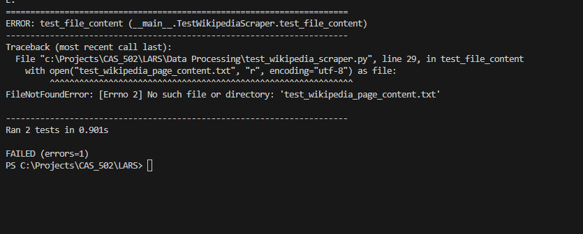
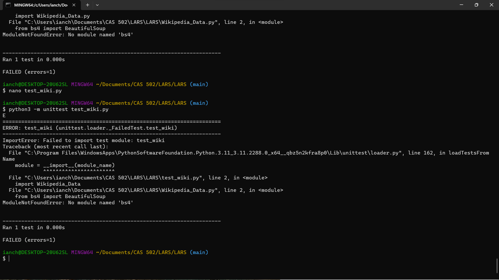
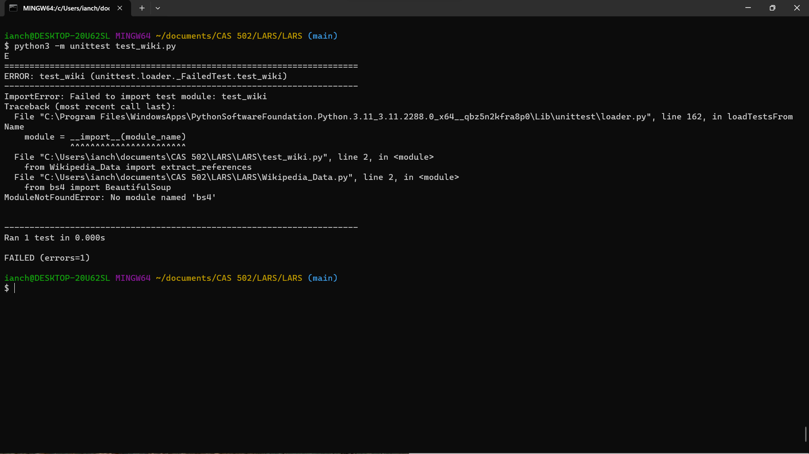
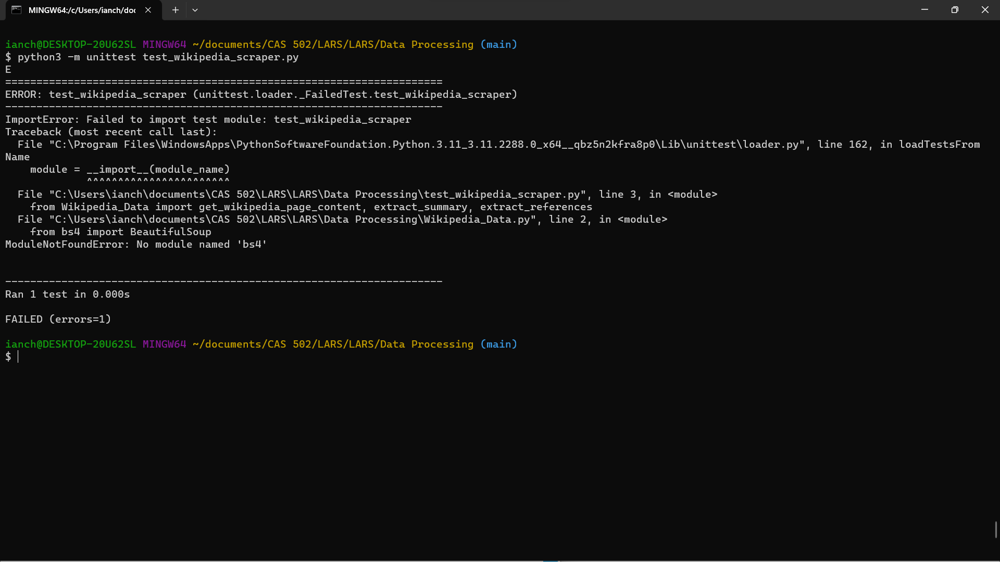
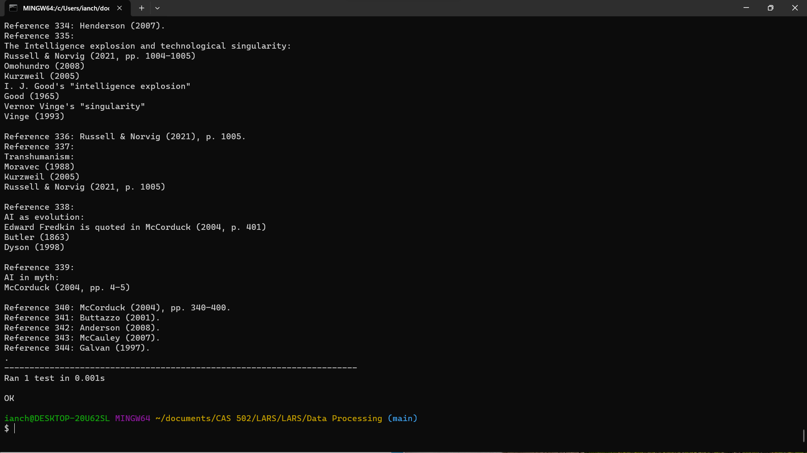
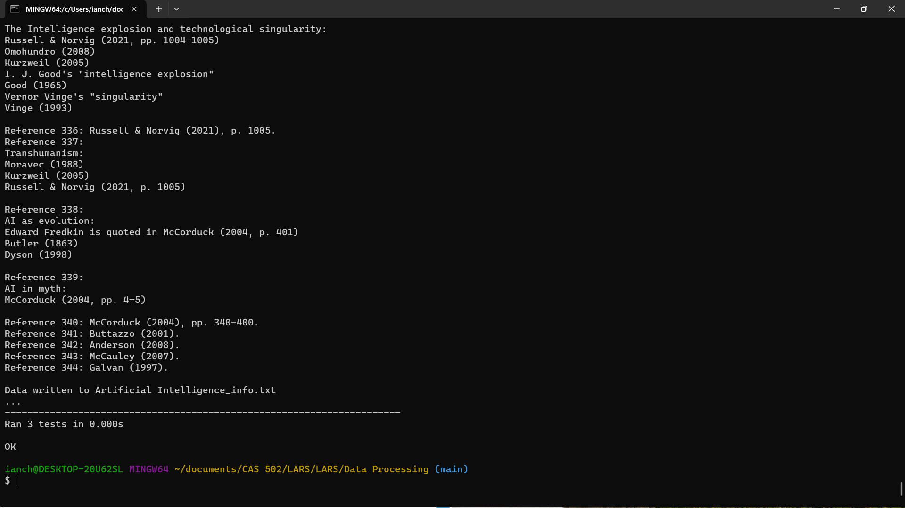

# 

Copy and paste the .png int the data side when you upload the image to the repository

)

)

)

As of 11:41 2/17/24 The following experiences were had:
Ian and I worked on the unit tests, and while working on them we decided to do some simple checks on some code we already had from some data we can readily collect. While working on it we thought it would be a good idea to create a centralized location to put our homework so we don't have to run into issues as last time. Also, these eases up on any mistakes sharing information. Additionally
