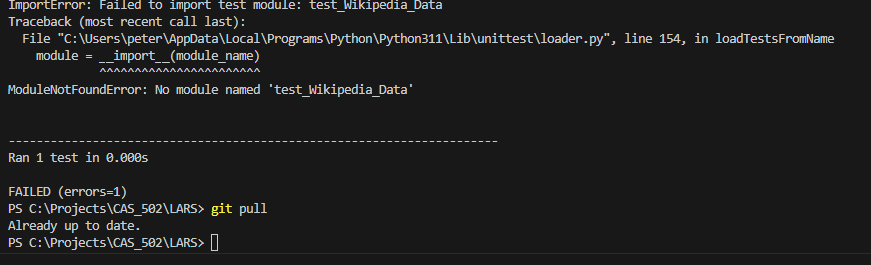

The test files we created are located in the Data Processing file:

https://github.com/PlanetHopf/LARS/blob/main/Data%20Processing/test_wikipedia_scraper.py

https://github.com/PlanetHopf/LARS/blob/main/Data%20Processing/test_wiki.py

https://github.com/PlanetHopf/LARS/blob/main/Data%20Processing/test_wiki_summary.py

This is a test image to see if it was working.
()

Here I tested the scraper to test the import testit and to test to see if the wikipedia scraper also ran throught this file.

First run of test_wiki.py (reference chunk of Wikipedia_Data.py).

Second run of test_wiki.py. Gives the same error message. Tried installing beautifulsoup in my IDE but it was already up to date.

Tried running test_wikipedia_scraper.py. Same error message as before. Not sure why it will not recognize BeautifulSoup.

Okay! Had to install beautifulsoup on the command line and it worked!

Test for the summary chunk. Works fine.

As of 11:41 2/17/24 The following experiences were had:
Ian and I worked on the unit tests, and while working on them we decided to do some simple checks on some code we already had from some data we can readily collect. While working on it we thought it would be a good idea to create a centralized location to put our homework so we don't have to run into issues as last time. Also, these eases up on any mistakes sharing information. Additionally, I have been trying to make a place for centralized testing for any future code.
